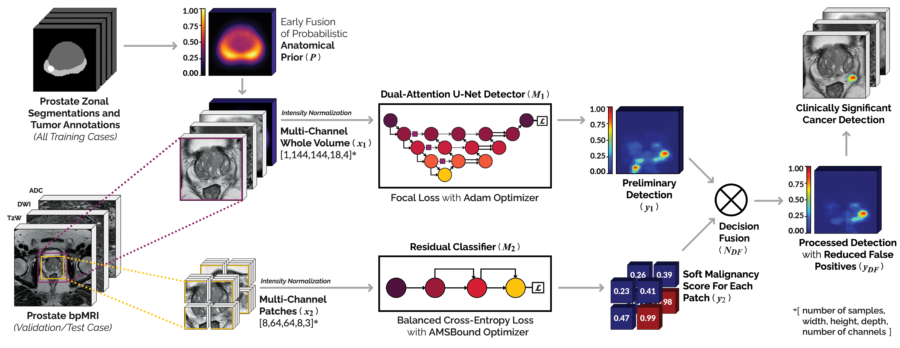

# End-to-End Prostate Cancer Detection in bpMRI via 3D CNNs: Effect of Attention Mechanisms, Clinical Priori and Decoupled False Positive Reduction

**Authors**: Anindo Saha, Matin Hosseinzadeh, Henkjan Huisman

**Note**: The following repo is currently in-development.

*Proposed end-to-end 3D computer-aided detection and diagnosis framework for automated localization of clinically significant prostate cancer in bi-parametric MR imaging. Two ROIs are center-cropped from the multi-channel concatenation of the patient’s T2W, DWI and ADC scans as the input for the model’s 3D CNN sub-models (M1, M2). M1 is a dual-attention detection network, that adaptively targets the most discriminate feature dimensions and spatially salient prostatic structures in the image volume. Additionally, it leverages an anatomical prior P in its input x1 to synthesize domain-specific clinical priori and generate a preliminary detection map y1. M2 is a decoupled residual classifier that infers on a set of overlapping patches x2 and maps them to a corresponding set of probabilistic malignancy scores y2.  Decision fusion node NDF aggregates y1, y2 to produce the model output yDF, i.e. a post-processed detection map with high sensitivity and reduced false positives.*  

**Related Publication(s):**  
  ● [A. Saha, M. Hosseinzadeh, H. Huisman (2020), "Encoding Clinical Priori in 3D Convolutional Neural Networks for Prostate Cancer Detection in bpMRI", Medical Imaging Meets
  NeurIPS Workshop – 34th Conference on Neural Information Processing Systems (NeurIPS), Vancouever, Canada.](https://arxiv.org/abs/2011.00263)
  
  ● [A. Saha, M. Hosseinzadeh, H. Huisman (2021), "End-to-End Prostate Cancer Detection in bpMRI via 3D CNNs: Effect of Attention Mechanisms, Clinical Priori and Decoupled False
  Positive Reduction", *Under Review at MedIA: Medical Image Analysis*.](https://arxiv.org/abs/2101.03244)

