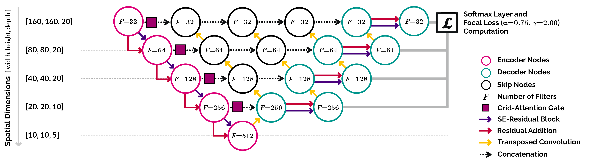

# Clinically Significant Prostate Cancer Detection in bpMRI

**Note**: This repo will be continually updated upon future advancements and we welcome open-source contributions! Currently, it shares the TensorFlow 2.5 version of the Hierarchical Probabilistic 3D U-Net (with attention mechanisms, nested decoder structure and deep supervision), titled `M1`, as explored in the publication(s) listed below. Source code used for training this model, as per our original setup, carry a large number of dependencies on internal datasets, tooling, infrastructure and hardware, and their release is currently not feasible. However, an equivalent minimal adaptation has been made available. We encourage users to test out `M1`, identify potential areas for significant improvement and propose PRs for inclusion to this repo.

**Pre-Trained Model using 1950 bpMRI with [PI-RADS v2](https://www.sciencedirect.com/science/article/pii/S0302283815008489?via%3Dihub) Annotations [Training:Validation Ratio - 80:20]:**  
To infer lesion predictions on testing samples using the pre-trained variant [(architecture in commit 58b784f)](https://github.com/DIAGNijmegen/prostateMR_3D-CAD-csPCa/tree/58b784ffbd2e8c89139c6773cb9490b2fd53d814) of this algorithm, please visit https://grand-challenge.org/algorithms/prostate-mri-cad-cspca/

**Main Scripts**  
● Preprocessing Functions: [`tf2.5/scripts/preprocess.py`](https://github.com/DIAGNijmegen/prostateMR_3D-CAD-csPCa/blob/main/tf2.5/scripts/preprocess.py)  
● Tensor-Based Augmentations: [`tf2.5/scripts/model/augmentations.py`](https://github.com/DIAGNijmegen/prostateMR_3D-CAD-csPCa/blob/main/tf2.5/scripts/model/augmentations.py)   
● Training Script Template: [`tf2.5/scripts/train_model.py`](https://github.com/DIAGNijmegen/prostateMR_3D-CAD-csPCa/blob/main/tf2.5/scripts/train_model.py)  
● Basic Callbacks (e.g. LR Schedules): [`tf2.5/scripts/callbacks.py`](https://github.com/DIAGNijmegen/prostateMR_3D-CAD-csPCa/blob/main/tf2.5/scripts/callbacks.py)  
● Loss Functions: [`tf2.5/scripts/model/losses.py`](https://github.com/DIAGNijmegen/prostateMR_3D-CAD-csPCa/blob/main/tf2.5/scripts/model/losses.py)  
● Network Architecture: [`tf2.5/scripts/model/unets/networks.py`](https://github.com/DIAGNijmegen/prostateMR_3D-CAD-csPCa/blob/main/tf2.5/scripts/model/unets/networks.py)  

**Requirements**  
● Complete Docker Container: [`anindox8/m1:latest`](https://hub.docker.com/r/anindox8/m1)  
● Key Python Packages: [`tf2.5/requirements.txt`](https://github.com/DIAGNijmegen/prostateMR_3D-CAD-csPCa/blob/main/tf2.5/requirements.txt)  

<kbd></kbd>
Train-time schematic for the Bayesian/hierarchical probabilistic configuration of `M1`. `L_S` denotes the segmentation loss between prediction `p` and ground-truth `Y`. Additionally, `L_KL`, denoting the Kullback–Leibler divergence loss between prior distribution `P` and posterior distribution `Q`, is used at train-time (refer to [arXiv:1905.13077](https://arxiv.org/abs/1905.13077)). For each execution of the model, latent samples `z_i ∈ Q` (train-time) or `z_i ∈ P` (test-time) are successively drawn at increasing scales of the model to predict one segmentation mask `p`.

<kbd></kbd>
Architecture schematic of `M1`, with attention mechanisms and a nested decoder structure with deep supervision. When `dense_skip=False`, all black/skip nodes disappear and `M1` simplifies down to an [Attention U-Net](https://github.com/ozan-oktay/Attention-Gated-Networks) with SEResNet blocks.

**Minimal Example of Model Setup in TensorFlow 2.5:**  
*(More Details: [Training CNNs in TF2: Walkthrough](https://www.tensorflow.org/tutorials/images/segmentation); [TF2 Datasets: Best Practices](https://www.tensorflow.org/guide/data_performance); [TensorFlow Probability](https://www.tensorflow.org/probability))*
```python
# U-Net Definition (Note: Hyperparameters are Data-Centric -> Require Adequate Tuning for Optimal Performance)
unet_model = unets.networks.M1(\
                        input_spatial_dims =  (20,160,160),            
                        input_channels     =   3,
                        num_classes        =   2,                       
                        filters            =  (32,64,128,256,512),   
                        strides            = ((1,1,1),(1,2,2),(1,2,2),(2,2,2),(2,2,2)),  
                        kernel_sizes       = ((1,3,3),(1,3,3),(3,3,3),(3,3,3),(3,3,3)),
                        prob_latent_dims   =  (3,2,1,0)
                        dropout_rate       =   0.50,       
                        dropout_mode       =  'monte-carlo',
                        se_reduction       =  (8,8,8,8,8),
                        att_sub_samp       = ((1,1,1),(1,1,1),(1,1,1),(1,1,1)),
                        kernel_initializer =   tf.keras.initializers.Orthogonal(gain=1), 
                        bias_initializer   =   tf.keras.initializers.TruncatedNormal(mean=0, stddev=1e-3),
                        kernel_regularizer =   tf.keras.regularizers.l2(1e-4),
                        bias_regularizer   =   tf.keras.regularizers.l2(1e-4),     
                        cascaded           =   False,
                        dense_skip         =   True,
                        probabilistic      =   True,
                        deep_supervision   =   True,
                        summary            =   True)  

# Schedule Cosine Annealing Learning Rate with Warm Restarts
LR_SCHEDULE = (tf.keras.optimizers.schedules.CosineDecayRestarts(\
                        initial_learning_rate=1e-3, t_mul=2.00, m_mul=1.00, alpha=1e-3,
                        first_decay_steps=int(np.ceil(((TRAIN_SAMPLES)/BATCH_SIZE)))*10))
                                                  
# Compile Model w/ Optimizer and Loss Function(s)
unet_model.compile(optimizer = tf.keras.optimizers.Adam(learning_rate=LR_SCHEDULE, amsgrad=True), 
                   loss      = losses.Focal(alpha=[0.75, 0.25], gamma=2.00).loss)

# Train Model
unet_model.fit(...)
```

**If you use this repo or some part of its codebase, please cite the following articles (see [bibtex](https://github.com/DIAGNijmegen/prostateMR_3D-CAD-csPCa/blob/main/docs/citations.bib)):**  
 
  ● [A. Saha, J. Bosma, J. Linmans, M. Hosseinzadeh, H. Huisman (2021), "Anatomical and Diagnostic Bayesian Segmentation in Prostate MRI −Should Different Clinical Objectives Mandate Different Loss Functions?", Medical Imaging Meets
  NeurIPS Workshop – 35th Conference on Neural Information Processing Systems (NeurIPS), Sydney, Australia.](https://arxiv.org/abs/2110.12889) [(architecture in commit 914ec9d)](https://github.com/DIAGNijmegen/prostateMR_3D-CAD-csPCa/blob/914ec9db3c5ef4c44f371b82204d181a45bfc97d/tf2.5/models/networks.py)
  
  ● [A. Saha, M. Hosseinzadeh, H. Huisman (2021), "End-to-End Prostate Cancer Detection in bpMRI via 3D CNNs: Effect of Attention Mechanisms, Clinical Priori and Decoupled False
  Positive Reduction", Medical Image Analysis:102155.](https://doi.org/10.1016/j.media.2021.102155) [(architecture in commit 58b784f)](https://github.com/DIAGNijmegen/prostateMR_3D-CAD-csPCa/blob/58b784ffbd2e8c89139c6773cb9490b2fd53d814/tf2.5/models/networks.py)

  ● [A. Saha, M. Hosseinzadeh, H. Huisman (2020), "Encoding Clinical Priori in 3D Convolutional Neural Networks for Prostate Cancer Detection in bpMRI", Medical Imaging Meets
  NeurIPS Workshop – 34th Conference on Neural Information Processing Systems (NeurIPS), Vancouver, Canada.](https://arxiv.org/abs/2011.00263) [(architecture in commit 58b784f)](https://github.com/DIAGNijmegen/prostateMR_3D-CAD-csPCa/blob/58b784ffbd2e8c89139c6773cb9490b2fd53d814/tf2.5/models/networks.py)

**Contact:** anindo@ieee.org; matin.hosseinzadeh@radboudumc.nl 

**Related U-Net Architectures:**  
  ● nnU-Net: https://github.com/MIC-DKFZ/nnUNet  
  ● Attention U-Net: https://github.com/ozan-oktay/Attention-Gated-Networks  
  ● UNet++: https://github.com/MrGiovanni/UNetPlusPlus  
  ● Hierarchical Probabilistic U-Net: https://github.com/deepmind/deepmind-research/tree/master/hierarchical_probabilistic_unet  


